# AssetManager Workflow Diagrams

This document provides detailed workflow diagrams for the AssetManager, showing both current state and proposed refactored state using Mermaid diagrams.

**Date:** 2025-12-24  
**Related:** ASSET_MANAGER_ANALYSIS.md

---

## Table of Contents

1. [Current State Workflows](#current-state-workflows)
2. [Proposed State Workflows](#proposed-state-workflows)
3. [Component Interaction Diagrams](#component-interaction-diagrams)
4. [Data Flow Diagrams](#data-flow-diagrams)

---

## Current State Workflows

### Current Workflow 1: Engine Startup and Default Asset Loading

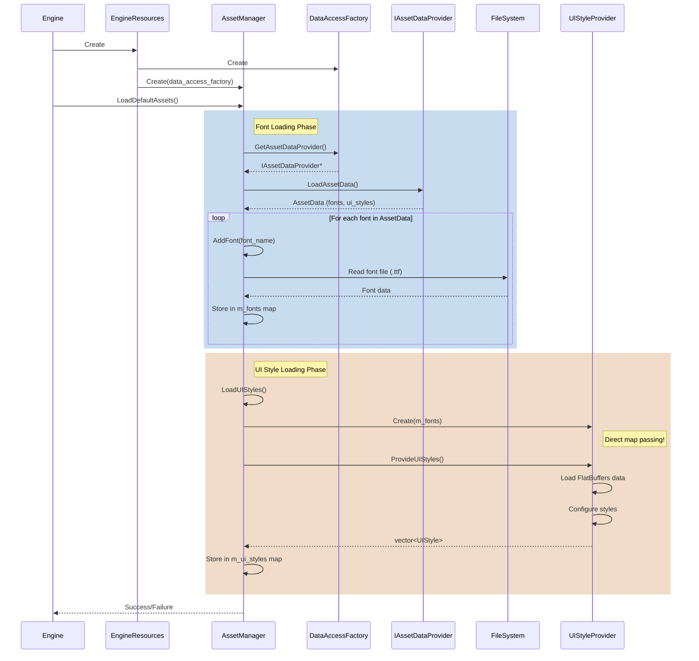

### Current Workflow 2: Scene Change Asset Loading

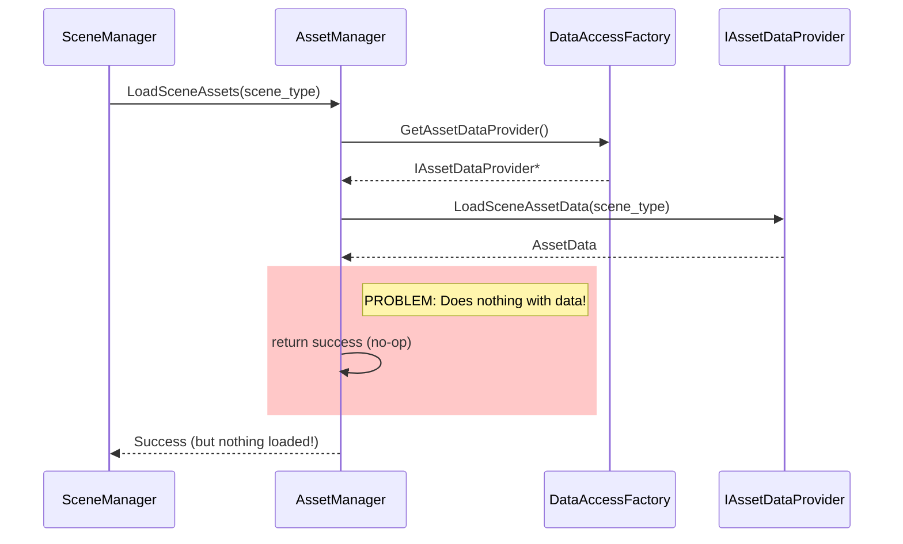

### Current Workflow 3: Font Access Pattern

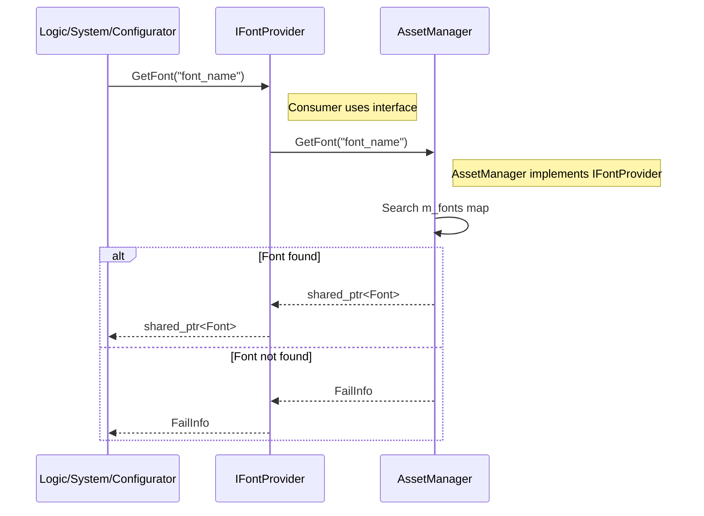

### Current Workflow 4: UI Style Configuration (Detailed)

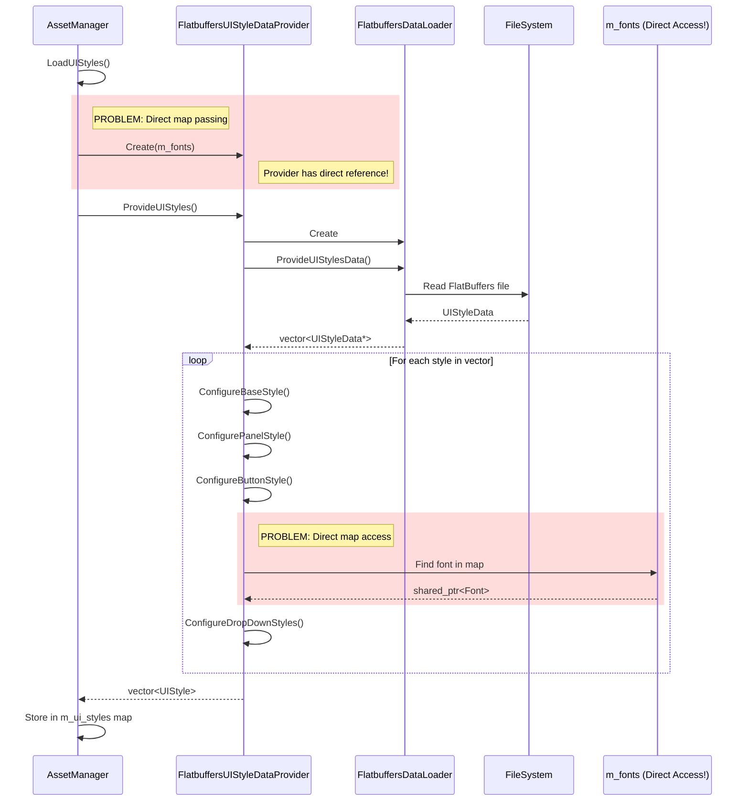

---

## Proposed State Workflows

### Proposed Workflow 1: Engine Startup and Default Asset Loading

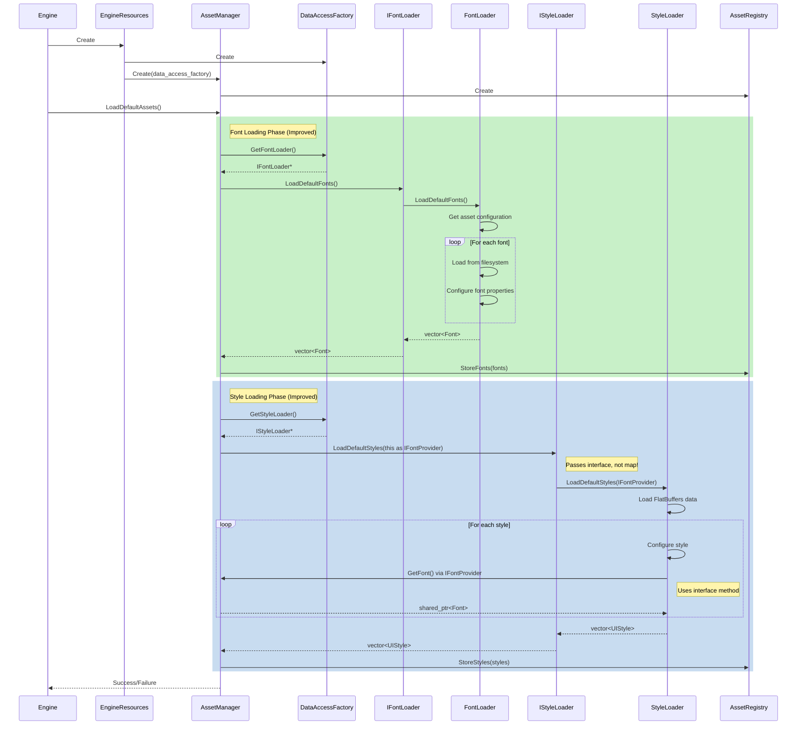

### Proposed Workflow 2: Scene Change Asset Loading

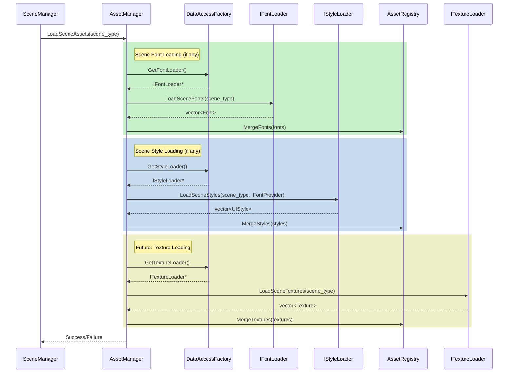

### Proposed Workflow 3: Font Access Pattern (Unchanged)

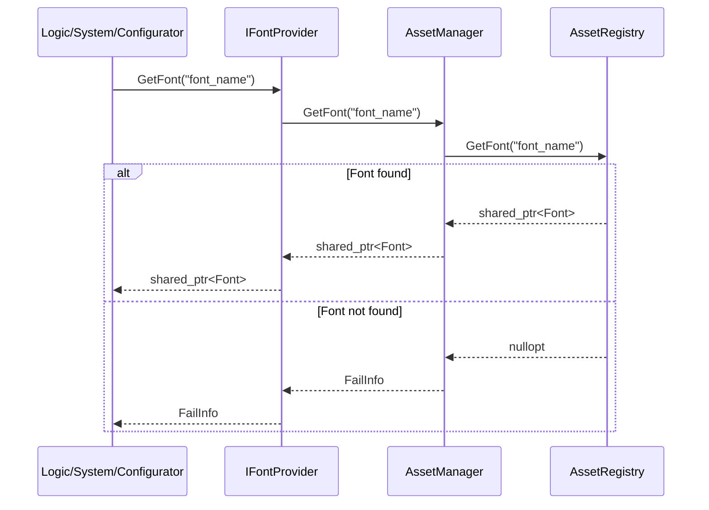

### Proposed Workflow 4: UI Style Configuration (Improved)

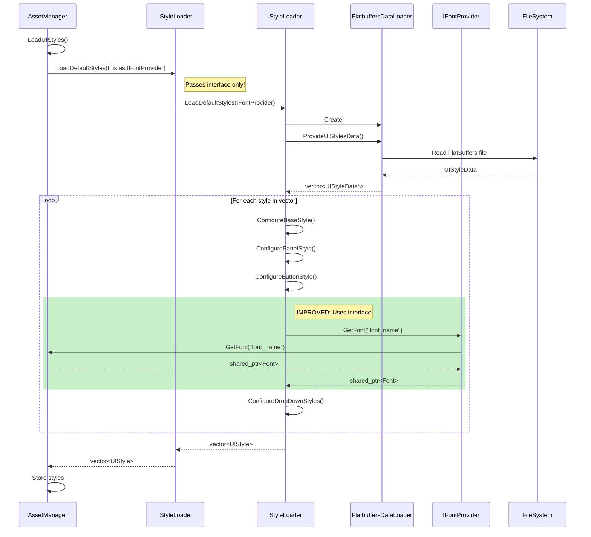

---

## Component Interaction Diagrams

### Current State Component Interactions

```mermaid
graph TB
    subgraph "Current Architecture"
        AssetManager[AssetManager<br/>- m_fonts map<br/>- m_ui_styles map<br/>- LoadDefaultAssets<br/>- LoadSceneAssets<br/>- AddFont<br/>- LoadUIStyles]
        
        DataAccessFactory[DataAccessFactory]
        IAssetDataProvider[IAssetDataProvider<br/>Interface]
        FlatbuffersAssetDP[FlatbuffersAssetDataProvider]
        
        UIStyleProvider[FlatbuffersUIStyleDataProvider<br/>Direct access to m_fonts!]
        IFontProvider[IFontProvider<br/>Interface]
        
        FileSystem[FileSystem<br/>Font files]
        
        AssetManager -->|creates directly| UIStyleProvider
        AssetManager -.->|passes m_fonts<br/>PROBLEM!| UIStyleProvider
        AssetManager -->|implements| IFontProvider
        AssetManager -->|uses| DataAccessFactory
        AssetManager -->|reads from| FileSystem
        
        DataAccessFactory -->|provides| IAssetDataProvider
        IAssetDataProvider <|.. FlatbuffersAssetDP
        
        UIStyleProvider -->|accesses directly<br/>PROBLEM!| AssetManager
    end
    
    style UIStyleProvider fill:#ffcccc
    style AssetManager fill:#ffffcc
```

### Proposed State Component Interactions

```mermaid
graph TB
    subgraph "Proposed Architecture"
        AssetManager[AssetManager<br/>- AssetRegistry member<br/>- LoadDefaultAssets<br/>- LoadSceneAssets<br/>- Coordinates loaders]
        
        AssetRegistry[AssetRegistry<br/>- m_fonts map<br/>- m_ui_styles map<br/>- m_textures map<br/>- Add/Get methods]
        
        DataAccessFactory[DataAccessFactory]
        
        IFontLoader[IFontLoader<br/>Interface]
        FontLoader[FontLoader<br/>File I/O]
        
        IStyleLoader[IStyleLoader<br/>Interface]
        StyleLoader[StyleLoader<br/>Configuration]
        
        IFontProvider[IFontProvider<br/>Interface]
        
        FileSystem[FileSystem]
        
        AssetManager -->|owns| AssetRegistry
        AssetManager -->|uses| DataAccessFactory
        AssetManager -->|implements| IFontProvider
        AssetManager -->|gets loaders from| DataAccessFactory
        
        DataAccessFactory -->|provides| IFontLoader
        DataAccessFactory -->|provides| IStyleLoader
        
        IFontLoader <|.. FontLoader
        IStyleLoader <|.. StyleLoader
        
        FontLoader -->|reads from| FileSystem
        StyleLoader -.->|uses interface| IFontProvider
        IFontProvider <|.. AssetManager
        
        AssetManager -->|delegates storage| AssetRegistry
    end
    
    style AssetManager fill:#ccffcc
    style AssetRegistry fill:#ccffcc
    style StyleLoader fill:#ccffcc
```

---

## Data Flow Diagrams

### Current State Data Flow

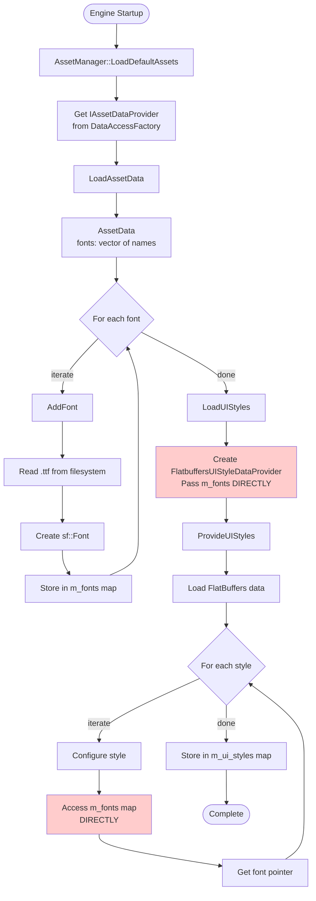

### Proposed State Data Flow

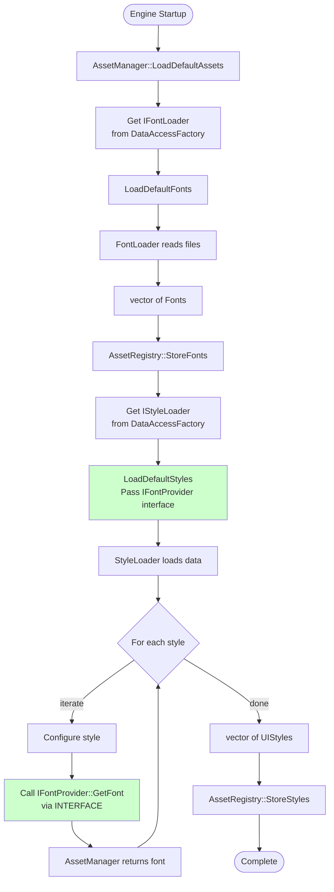

### Scene Asset Loading Data Flow (Proposed)

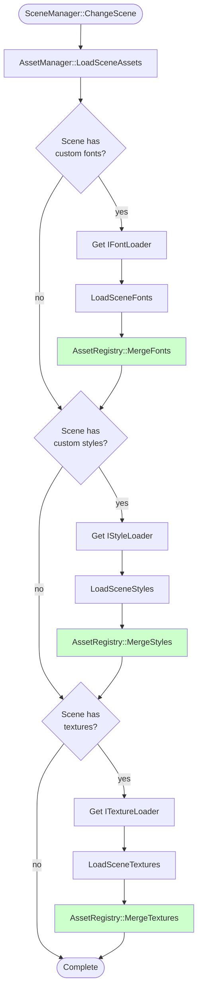

---

## Comparison: Before vs After

### Responsibility Separation

**Before:**
```
AssetManager = Registry + Loading + Configuration + Access
```

**After:**
```
AssetManager = Coordination + Access
AssetRegistry = Storage
FontLoader = Font I/O
StyleLoader = Style Configuration
```

### Coupling Reduction

**Before:**
- AssetManager → FlatbuffersUIStyleDataProvider (tight coupling)
- FlatbuffersUIStyleDataProvider → m_fonts (encapsulation violation)

**After:**
- AssetManager → IStyleLoader (loose coupling via interface)
- StyleLoader → IFontProvider (loose coupling via interface)

### Testability Improvement

**Before:**
- Must test AssetManager with real files
- Cannot test style loading without AssetManager
- Hard to mock font access

**After:**
- Can test AssetManager with mock loaders
- Can test StyleLoader with mock IFontProvider
- Easy to provide test fonts without files

---

## Summary

### Current State Problems (Visualized)

1. **Tight Coupling:** Direct instantiation and map passing
2. **Mixed Responsibilities:** Registry + Loading + Configuration in one class
3. **Encapsulation Violation:** Internal map passed to external component
4. **Incomplete Features:** Scene loading does nothing

### Proposed State Benefits (Visualized)

1. **Loose Coupling:** Interface-based dependencies
2. **Clear Responsibilities:** Separate classes for storage, loading, configuration
3. **Proper Encapsulation:** Only interfaces exposed
4. **Complete Features:** Scene loading functional

### Migration Path

Phase 1-2: Create new components (non-breaking)  
Phase 3-4: Refactor existing code (controlled breaking)  
Phase 5-6: Complete features and fix bugs

---

## Document Metadata

**Created:** 2025-12-24  
**Author:** GitHub Copilot Agent  
**Format:** Mermaid diagrams (GitHub compatible)  
**Related:** ASSET_MANAGER_ANALYSIS.md  
**Status:** Complete  
**Review:** Pending
